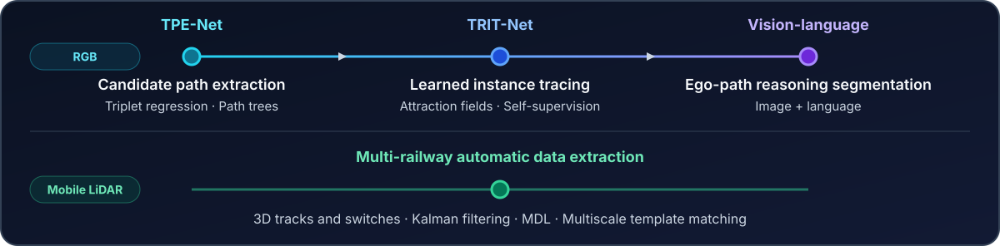

  

  <a href="https://linkedin.com/in/mjghvakili">LinkedIn</a>
  ·
  <a href="https://hub.docker.com/u/mvakili96">Docker Hub</a>

<table>
  <tr>
    <td align="center" width="25%"><strong>RGB · LiDAR · Natural language</strong> Perception modalities</td>
    <td align="center" width="25%"><strong>Research + engineering</strong> Data pipeline, Modeling, training, evaluation, containers, APIs, CI/CD</td>
    <td align="center" width="25%"><strong>3 published + 3 forthcoming</strong> Selected research output</td>
  </tr>
</table>

## About

I am an **AI Research Engineer and PhD Candidate at York University** working on reliable perception for autonomous systems. My research spans RGB and LiDAR scene understanding, self-supervised learning, and vision-language models, supported by hands-on experience with distributed GPU training, HPC infrastructure, reproducible evaluation, and containerized applications.

Beyond research, I build tested backend systems and developer workflows using Flask, Redis, Docker, GitHub Actions, and pytest.

## Technical toolkit

<table>
  <tr>
    <td width="50%" valign="top">
      <strong>AI research areas</strong>  
      Computer Vision · Deep Learning · Multimodal AI · Vision-Language Models · Semantic and Instance Segmentation · Self-Supervised Learning · LiDAR Point Cloud · Depth Estimation · 3D Reconstruction
    </td>
    <td width="50%" valign="top">
      <strong>ML frameworks and libraries</strong>  
      Python · PyTorch · OpenCV · NumPy · Pandas · scikit-learn · TorchVision · MMDetection · MMSegmentation · LoRA/PEFT
    </td>
  </tr>
  <tr>
    <td width="50%" valign="top">
      <strong>Distributed training and infrastructure</strong>  
      PyTorch DDP · DeepSpeed · Slurm · Apptainer · Docker · Docker Compose
    </td>
    <td width="50%" valign="top">
      <strong>Software and MLOps</strong>  
      Flask · Redis Stack · REST APIs · pytest · CI/CD · GitHub Actions · Git · Weights & Biases
    </td>
  </tr>
</table>

## Research trajectory

  

## Selected work

### 01 / Reasoning-Guided Railway Perception

A railway-domain adaptation of **[LISA](https://openaccess.thecvf.com/content/CVPR2024/html/Lai_LISA_Reasoning_Segmentation_via_Large_Language_Model_CVPR_2024_paper.html)** that combines a LLaVA-style multimodal backbone, SAM-based mask prediction, and LoRA fine-tuning to segment the valid ego-path in railway switch scenes from an image and language prompt using 8 NVIDIA L40 GPUs across 2 nodes. The project adds rail-specific prompts, polygon-mask and explanation supervision, and distributed training workflows using DeepSpeed, Slurm, and Apptainer.

- **Accepted and presented in ISPRS Conference 2026**

`PyTorch` · `LLaVA` · `SAM` · `LoRA` · `DeepSpeed` · `Slurm` · `Apptainer` . `W&B`

[Explore the code →](https://github.com/mvakili96/Railway_Perception_FoundationModel)  
Railway-domain adaptation built on the open-source LISA project.

---

### 02 / TPE-Net → TRIT-Net

**TPE-Net** extracts and associates triplet rail points into path trees to generate multiple candidate paths through complex switch scenes. **TRIT-Net builds on TPE-Net** with a multi-head framework that predicts centerline and **Attraction Field** representations for bottom-up instance tracing and controlled branching. The current TRIT-Net research also adds [VICReg](https://openreview.net/forum?id=xm6YD62D1Ub)-style self-supervised encoder pretraining using **23,924 unlabeled railway images** and multi-dataset evaluation.

- **TPE-Net** — Published at [IEEE CASE 2023](https://doi.org/10.1109/CASE56687.2023.10260541) · Journal extension under review at *IEEE Transactions on Intelligent Transportation Systems*
- **TRIT-Net** — Published at [CRV 2025](https://crv.pubpub.org/pub/h6d3dccv) · Journal extension under review at *Engineering Applications of Artificial Intelligence*

`PyTorch` · `OpenCV` · `Transformers` · `VICReg` · `DDP/NCCL` · `Slurm` · `Apptainer` · `W&B`

[Explore the shared code repository →](https://github.com/mvakili96/TRIT-Net) 
TRIT-Net builds on TPE-Net, and both projects are maintained in this repository.

---

### 03 / Multi-Railway Automatic Data Extraction

An automated railway-asset extraction pipeline for mobile laser scanning point clouds. It traces individual rail vectors using Kalman filtering, detects multi-track regions through minimum description length model selection, and recognizes switch orientation, status, and merge/split type using multiscale template matching.

- **[Multi-Railway Track and Switch Region Recognition Using Mobile Laser Scanning Data](https://doi.org/10.1109/ITSC60802.2025.11423103)** — Published at IEEE ITSC 2025

The source repository remains private.

---

### 04 / ChipIn

A Flask and Redis Stack application for managing users, groups, expenses, and settlement calculations. It includes a browser admin panel, Telegram Mini App and bot integration, server-side Telegram authentication, Docker Compose environments, and automated unit and live-service integration tests.

**GitHub Actions** validates pytest-based unit tests and a Docker Compose integration flow against Redis Stack.

`Flask` · `Redis Stack` · `REST APIs` · `Docker Compose` · `pytest` · `GitHub Actions` · `CI/CD`

[Explore the project →](https://github.com/mvakili96/ChipIn)

## Experience

**Graduate Researcher · Augmented Urban Space Modelling Lab, York University · 2021–present**  
Develops end-to-end railway-perception workflows spanning RGB and LiDAR data, dataset preparation, supervised and self-supervised training, vision-language model adaptation, and benchmark evaluation.

**Visiting Researcher · Smart Mobility Lab, Hanyang University · 2026**  
Worked on foundation-model pipelines for delivery-robot survey data, including object perception, depth estimation, and 3D reconstruction.

Earlier work spans autonomous agricultural systems, 3D mapping, embedded sensing and actuation, signal processing, and mechanical design.

## Education

- **PhD Candidate, Earth and Space Science and Engineering** — York University
- **MSc, Mechanical Engineering** — Sharif University of Technology
- **BSc, Mechanical Engineering** — University of Tehran

## Beyond the lab

Outside AI research, I am a personal trainer and HIIT instructor recognized as the **Tait McKenzie Centre's Personal Trainer of the Year for 2024–2025**.

---

  <strong>Interested in computer vision, multimodal AI, autonomous perception, or real-world ML systems?</strong>
    
  <a href="https://linkedin.com/in/mjghvakili">Let's connect on LinkedIn</a>

