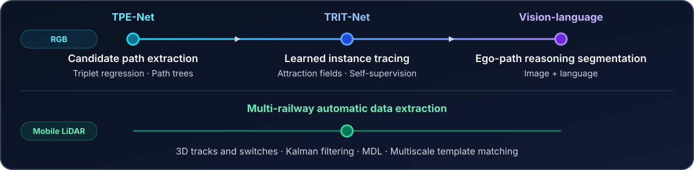

<h1 align="center">Mohammadjavad Ghorbanalivakili</h1>

<strong>AI Research Engineer · PhD in Computer Vision & Autonomous Perception at York University</strong>

  I build computer vision and multimodal AI systems, from preparing datasets and training models to building tested software.

  <a href="https://linkedin.com/in/mjghvakili">LinkedIn</a>
  ·
  <a href="https://huggingface.co/m-vakili75">Hugging Face</a>
  ·
  <a href="https://hub.docker.com/u/mvakili96">Docker Hub</a>
   
  Toronto, Canada · Open to relocation

## About

Over the past five years, I've worked with images, LiDAR point clouds, and language to tackle perception problems in transportation and robotics. I develop models, build the data and evaluation pipelines around them, and run reproducible experiments on GPU clusters.

I also build software beyond perception: a [source-grounded interview-prep assistant](#05--concept-to-code-grounded-interview-prep-rag) and a [shared-expense application with automated tests and deployment workflows](#04--chipin).

  <a href="#selected-work">Explore my projects</a> · <a href="#technical-toolkit">Browse my toolkit</a> · <a href="#experience">See my experience</a>

## Technical toolkit

<table>
  <tr>
    <td width="50%" valign="top">
      <strong>AI research areas</strong>  
      Computer vision · Multimodal AI · Vision-language models 
      Object detection · Semantic, instance &amp; panoptic segmentation 
      Supervised &amp; self-supervised learning · Depth estimation · 3D reconstruction
    </td>
    <td width="50%" valign="top">
      <strong>ML frameworks and libraries</strong>  
      Python · PyTorch · OpenCV · NumPy · Pandas · scikit-learn 
      TorchVision · MMDetection · MMSegmentation · LoRA/PEFT 
      MATLAB · Bash
    </td>
  </tr>
  <tr>
    <td width="50%" valign="top">
      <strong>Distributed training and infrastructure</strong>  
      PyTorch DDP · DeepSpeed · Slurm · Apptainer 
      Docker · Docker Compose · Linux (Ubuntu) 
      Microsoft Azure · Google Cloud Platform
    </td>
    <td width="50%" valign="top">
      <strong>Software engineering and MLOps</strong>  
      Flask · Redis Stack · REST APIs  
      pytest · Playwright · GitHub Actions · CI/CD 
      Git · Weights &amp; Biases · OpenAI Codex
    </td>
  </tr>
  <tr>
    <td colspan="2" valign="top">
      <strong>Retrieval and language models</strong>  
      LangChain · FAISS · BM25 · Hybrid search · Cross-encoder reranking · Local Qwen inference
    </td>
  </tr>
</table>

## Research trajectory

  

## Selected work

### 01 / Reasoning-Guided Railway Perception

When several tracks meet at a switch, the model must identify the route the train can follow. In collaboration with **Canadian National Railway (CN)**, I adapted **[LISA-7B](https://openaccess.thecvf.com/content/CVPR2024/html/Lai_LISA_Reasoning_Segmentation_via_Large_Language_Model_CVPR_2024_paper.html)** to predict an ego-path mask and generate a route explanation from an image and language prompt.

I built rail-specific prompts, mask and explanation supervision, and a distributed training workflow using LoRA, DeepSpeed, Slurm, and Apptainer across eight NVIDIA L40 GPUs.

[Code](https://github.com/mvakili96/Railway_Perception_FoundationModel) · [Published ISPRS 2026 paper](https://isprs-archives.copernicus.org/articles/XLIX-B3-2026/89/2026/) · [Model weights](https://huggingface.co/m-vakili75/railway-lisa-7b-semantic-reasoning-clip)

---

### 02 / TPE-Net → TRIT-Net

This research traces individual rail paths through scenes where tracks split and merge. I developed **TPE-Net** in collaboration with **Thales Canada**, combining a regression CNN with graph-based spatial clustering to construct candidate paths.

I then built **TRIT-Net**, a hybrid transformer-convolution U-Net that learns **Attraction Field Maps** for tracing and branching. The project also uses [VICReg](https://openreview.net/forum?id=xm6YD62D1Ub) self-supervised pretraining on **23,924 unlabeled railway images**.

- **TPE-Net** was published at [IEEE CASE 2023](https://doi.org/10.1109/CASE56687.2023.10260541). Its journal extension is under review at *IEEE Transactions on Intelligent Transportation Systems*.
- **TRIT-Net** was published at [CRV 2025](https://crv.pubpub.org/pub/h6d3dccv). Its journal extension is under review at *Engineering Applications of Artificial Intelligence*.

[Explore the shared repository](https://github.com/mvakili96/TRIT-Net). TRIT-Net builds on TPE-Net, and both projects share this codebase.

---

### 03 / Multi-Railway Automatic Data Extraction

In this collaboration with **Thales Canada**, I was responsible for the experiments and paper writing. The team's mobile LiDAR pipeline combines Kalman filtering, minimum description length model selection, and multiscale template matching to extract railway tracks and recognize switch configurations.

[Read the IEEE ITSC 2025 paper](https://doi.org/10.1109/ITSC60802.2025.11423103). The source repository remains private under the industry collaboration.

---

### 04 / ChipIn

ChipIn helps groups record shared expenses and calculate who owes whom. In this collaborative side project, I developed a containerized **Flask and Redis Stack** backend with REST APIs, a browser admin panel, and Telegram integration. GitHub Actions runs the project's unit and integration tests.

[Explore ChipIn](https://github.com/mvakili96/ChipIn)

---

### 05 / Concept-to-Code: Grounded Interview Prep RAG

I'm building a local, source-grounded assistant that connects technical interview theory with targeted coding practice. Its current **retrieval-augmented generation (RAG)** pipeline answers questions across six PDFs totaling **6,059 pages** with page-level citations. It supports conversational follow-ups and active-source memory, persists BM25 and FAISS indexes between runs, reranks hybrid search results with a cross-encoder, and generates answers locally with **Qwen2.5-7B**.

On a source-audited **50-question benchmark**, the latest pipeline achieved **74.45% mean evidence-text recall** using the top four reranked chunks, averaged across 47 scored answerable questions. The project is now expanding toward recommending LeetCode problems that exercise the algorithmic patterns behind a technical concept. The first `/related` workflow is under development on a feature branch.

[Explore Concept-to-Code](https://github.com/mvakili96/Concept-to-Code) · [Read the evaluation](https://github.com/mvakili96/Concept-to-Code/blob/master/evaluation-results/summary.md)

## Experience

**Graduate Researcher · Augmented Urban Space Modelling Lab, York University · 2021–2026**

I developed railway perception pipelines from RGB images and LiDAR data through model training and benchmark evaluation. My work includes collaborations with **Thales Canada**, **Metrolinx**, and the **Ontario Autonomous Vehicle Innovation Network (OAVIN)**.

**Visiting Researcher · Smart Mobility Lab, Hanyang University · 2026**

I collaborated with **Neubility**, a Korean sidewalk delivery robot company, on foundation-model pipelines for object detection, depth estimation, and 3D reconstruction.

Earlier work spans autonomous agricultural systems, 3D mapping, embedded sensing and actuation, signal processing, and mechanical design.

## Education

- I earned my **PhD in Earth and Space Science and Engineering** at York University.
- I earned my **MSc in Mechanical Engineering** at Sharif University of Technology.
- I earned my **BSc in Mechanical Engineering** at the University of Tehran.

## Beyond the lab

Outside AI research, I am a casual-contract personal trainer and HIIT instructor, recognized as the **Tait McKenzie Centre's Personal Trainer of the Year for 2024–2025**.

---

  I'm open to research engineering and applied AI/ML opportunities, including relocation.
    
  <a href="https://linkedin.com/in/mjghvakili">Let's connect on LinkedIn</a>

